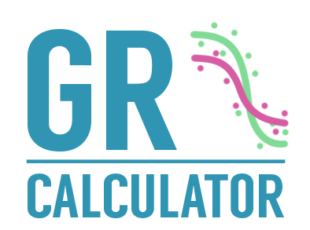

<a href = http://www.grcalculator.org>

</a>

## GRcalculator: an online tool for calculating and mining drug response data

GRcalculator is a Shiny application (http://www.grcalculator.org) developed to accompany the Nature paper *Growth rate inhibition metrics correct for confounders in measuring sensitivity to cancer drugs* by Hafner et al. (2016) http://dx.doi.org/10.1038/nmeth.3853.

For a brief overview of the GRcalculator and the importance of the newly developed GR metrics methodology (Hafner et al. 2016), see this poster:
https://figshare.com/articles/GRcalculator_an_online_tool_for_calculating_and_mining_drug_response_data/4244408

#### Citation
Hafner M, Niepel M, Chung M, Sorger PK: Growth rate inhibition metrics correct for confounders in measuring sensitivity to cancer drugs. Nature Methods 2016, 13(6):521-527.

#### Website design and online tool development

Nick Clark<sup>1</sup>, Marc Hafner<sup>2</sup>, Michal Kouril<sup>1</sup>, Mario Niepel<sup>2</sup>, Elizabeth Williams<sup>2</sup>, Jeremy Muhlich<sup>2</sup> and Mario Medvedovic<sup>1</sup>

<sup>1</sup> LINCS-BD2K Data Coordination and Integration Center, **University of Cincinnati**

<sup>2</sup> HMS LINCS Center, **Harvard Medical School**

## Offline installation

Install R package dependencies:

```r
# Install our "GRmetrics" Bioconductor package and others
source("http://bioconductor.org/biocLite.R")
biocLite("GRmetrics")
biocLite("S4Vectors")
# Install our "shinyLi" package
install.packages("devtools")
devtools::install_github("uc-bd2k/shinyLi")
# Install CRAN package dependencies
install.packages(c("shiny","shinyjs","shinyBS","ggplot2","plotly","drc","stringr","readr"))

```
Run the application from the R command line:
```r
shiny::runGitHub('uc-bd2k/grcalculator')
```
## Related software
The GRcalculator tool (http://www.grcalculator.org) is implemented in the form of three integrated Shiny applications (grcalculator, grbrowser and grtutorial).

### grtutorial (https://github.com/uc-bd2k/grtutorial)
The grtutorial Shiny application (“About GR Metrics” link in the toolbar) provides background information about the advantages of the GR metrics over traditional metrics for quantifying dose-response assays as well as descriptions of the GRcalculator tools.

### grbrowser (https://github.com/uc-bd2k/grbrowser)
The grbrowser Shiny application (“LINCS Dose-Response Datasets” section in the toolbar) facilitates interactive browsing and mining of drug response data generated by the LINCS project.

### GRmetrics R package (https://github.com/uc-bd2k/GRmetrics)
This package re-creates the online calculation and visualization tools available at http://www.grcalculator.org/grcalculator/.

**Bioconductor page**: https://bioconductor.org/packages/GRmetrics

**Vignette**: https://bioconductor.org/packages/release/bioc/vignettes/GRmetrics/inst/doc/GRmetrics-vignette.html

```R
# Use the following code to install the GRmetrics package in R
source("http://bioconductor.org/biocLite.R")
biocLite("GRmetrics")
```

### MATLAB and Python tools (https://github.com/sorgerlab/gr50_tools)
This repository contains the MATLAB, Python, and R implementations of GR metrics calculations with examples and supplementary information.
