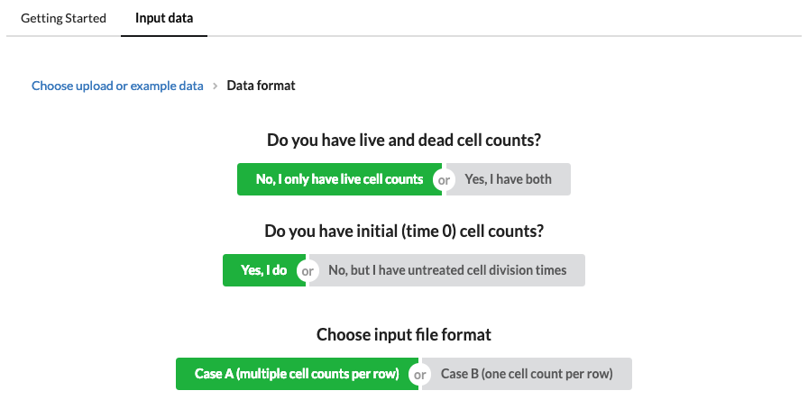

## Instructions for using GRcalculator

#### Introduction

The GRcalculator requires a data table of input suitable for a dose-response experiment where the output measured is cell count, or some surrogate of cell count such as cell-titer glo. To calculate a traditional dose-response curve of relative cell viability versus concentration, one would need only cell counts measured at the end of an assay for a number of treatment concentrations as well as an untreated control. From this curve, summary metrics such as IC50 and Emax can be calculated.

For the GR method, instead of cell viability relative to control, we calculate "growth rate inhibition" relative to control, which we call the "GR value". This is simply the ratio of the growth rate of cells under the treated condition to the growth rate of cells under the untreated condition. In order to estimate the growth rate of cells, we require an extra measurement of cell count at the beginning of the assay for both the treated and untreated conditions. If beginning cell numbers are roughly the same for many conditions, these conditions may share the same initial cell count estimate. We have also added support for a case in which an experimenter may not have initial cell counts, but does have an estimate of the cell division time in the untreated case. This may be slightly less accurate, but accomplishes the same goal as the measure of initial cell count.

#### Simple Example

In the most simple case the input data table will contain six columns, three of which identify the cells and their treatment, and three of which give the cell count measurements needed to calculate the GR value. The data should be in the form of an Excel-type table with column names in the first row, but needs to saved as a comma-separated (.csv) or tab-separated (.tsv) text file. Excel files may be converted to .csv using "Save as..." or a .csv can be easily written from statistical/data science software such as R/Rstudio.

For this case, we would click "Start" on the main page and then follow the input wizard. First, we are asked if we are counting live and dead cells or only live cells. Later we can consider the case where we have measured the number of dead cells as well, but for now we select that we have estimates of only the number of living cells. Next we select that we do have initial cell counts. Next, we select that our data is formatted with multiple cell counts in each row (which we call Case A). This is the most simple way to format the data, but we also allow the user to format the data in long format (Case B) with each cell count on a separate line.

